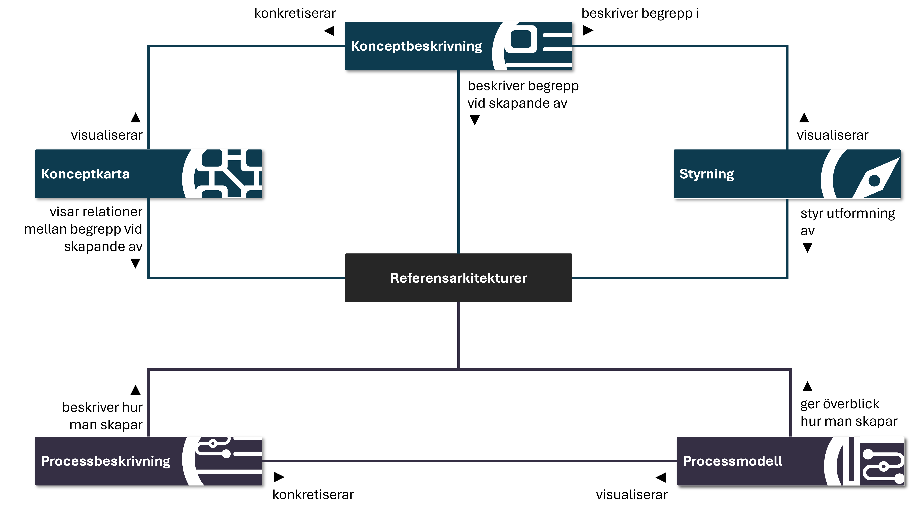
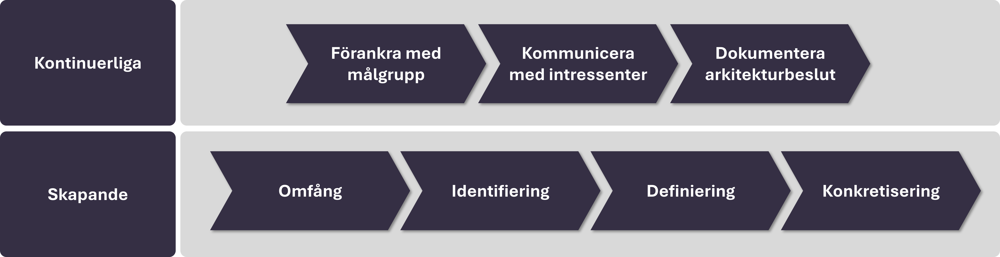

# Vägledning
*Higher Education Reference Architecture Framework*


**Version 0.5-Alfa**  
**2025-11-12**

## Innehåll

1. [Inledning](#inledning)
   1. [Bakgrund](#bakgrund)
   2. [Introduktion](#introduktion)
      - [Syfte](#syfte)
      - [Vad är en referensarkitektur?](#vad-är-en-referensarkitektur)
      - [Varför behövs en referensarkitektur?](#varför-behövs-en-referensarkitektur)
   3. [Begrepp](#begrepp)
   4. [Läsanvisning](#läsanvisning)
2. [HERAF](#heraf)
   1. [Vägledningen](#vägledningen)
   2. [HERAM](#heram)
3. [Skapa referensarkitektur](#skapa-referensarkitektur)
   1. [Kontinuerliga aktiviteter](#kontinuerliga-aktiviteter)
      - [Förankra med målgrupp](#förankra-med-målgrupp)
      - [Kommunicera med intressenter](#kommunicera-med-intressenter)
      - [Dokumentera arkitekturbeslut](#dokumentera-arkitekturbeslut)
   2. [Skapande aktiviteter](#skapande-aktiviteter)
      - [Omfång](#omfång)
      - [Identifiering](#identifiering)
      - [Definiering](#definiering)
      - [Konkretisering](#konkretisering)
4. [Exempel och mallar](#exempel-och-mallar)
5. [Begreppsreferenser](#begreppsreferenser)

---

## Inledning

### Bakgrund

Lärosäten inom den svenska högskolesektorn står inför liknande behov och utmaningar när det gäller att utveckla och förvalta strategiska och tekniska IT-lösningar. Erfarenheter från gemensamma möten visar att det saknas en enhetlig syn på vad en referensarkitektur är, hur den bör struktureras och vilket syfte den fyller. Detta skapar hinder för samarbete och förmågan att återanvända lösningar mellan lärosäten.

För att underlätta samarbete och skapa förutsättningar för enhetliga IT-lösningar tog ATI fram HERAF, ett stöd i hur referensarkitekturer ska utformas och struktureras.

### Introduktion

#### Syfte

Vägledningens syfte är att kort beskriva de centrala områden i HERAF (Higher Education Reference Architecture Framework) samt hur den används under skapandet av en referensarkitektur. Ramverket möjliggör att referensarkitekturer skapas på ett enhetligt och strukturerat sätt samtidigt som den lämnar utrymme för viss flexibilitet genom att undvika detaljstyrning.

#### Vad är en referensarkitektur?

En referensarkitektur är en mall eller ramverk som beskriver en rekommenderad struktur och organisering inom ett specifikt område. Den fungerar som en överenskommen vägledning och standardiseringsgrund för hur lösningar inom ett visst område bör implementeras.

```note Viktigt att veta
En referensarkitektur ska alltid utgå från tydligt definierade målgrupper och deras specifika behov för att bli relevant och användbar.
```

En väldefinierad referensarkitektur innehåller flera centrala komponenter:
- **Målgrupp** och deras specifika behov och utmaningar
- **Målarkitektur** som beskriver den önskade framtida lösningen  
- **Styrande principer** som vägleder arkitekturbeslut
- **Vyer** som visualiserar olika aspekter av arkitekturen
- **Riktlinjer** för implementation och användning

```example Exempel på referensarkitektur
Ett exempel på en referensarkitektur inom högskolan kan vara "Identitets- och åtkomsthantering för lärosäten" som definierar hur studenter och personal ska kunna logga in och få tillgång till olika system på ett säkert och effektivt sätt.
```

HERAF definiera en referensarkitektur enligt följande:

*"En referensarkitektur är en mall eller ramverk som beskriver en rekommenderad struktur och organisering inom ett specifikt område. Den fungerar som en överenskommen vägledning och standardiseringsgrund för hur en lösning inom ett visst område bör implementeras."*

#### Varför behövs en referensarkitektur?

En referensarkitektur ger en gemensam och beprövad grund som snabbar upp förändringsprocesser och minskar behovet av att uppfinna hjulet på nytt. Den fokuserar på det mest relevanta vid rätt tidpunkt och tydliggör vad som finns på plats och vad som återstår.

Detta ger inte bara en tydlighet av behovsbilden mot externa leverantörer utan hjälper även arkitekter när man tar beslut under designarbete.

### Begrepp

| Begrepp | Beskrivning |
|---------|-------------|
| **Angelägenhet ("Concern")** | En angelägenhet beskriver vad en intressent eller målgrupp anser vara viktigt i ett system eller en arkitektur. Det kan vara mål, behov, krav eller frågor som påverkar hur något ska utformas eller fungera.<br><br>Exempel: säkerhet, prestanda, användbarhet, kostnadseffektivitet. |
| **Aspekt** | En aspekt beskriver ett perspektiv eller en synvinkel som används för att analysera, beskriva eller utvärdera ett system. Den hjälper till att belysa hur olika angelägenheter hanteras i arkitekturen.<br><br>Exempel: säkerhetsaspekt, prestandaaspekt, tillgänglighetsaspekt. |
| **Aktivitetsgruppen** | Aktivitetsgruppen är den grupp som arbetar med framtagningen av referensarkitekturen. |

### Läsanvisning

Vägledningen kan läsas från början till slut för en samlad förståelse, eller användas som uppslagsverk för enskilda delar.

För praktiskt arbete rekommenderas att följa kapitlet Skapa referensarkitektur. För intressenter som önskar en förståelse av ramverket HERAF och dessa användning kan börja med de inledande avsnitten.

---

## HERAF


Ramverket innehåller material som beskriver, visualiserar och vägleder i hur man skapar en referensarkitektur. På en övergripande nivå innehåller ramverket två huvudsakliga områden, vägledningen och [HERAM].

Båda områden fyller olika syften där vägledningen är det material som vägleder och hjälper användningen av ramverket samt skapandet av en referensarkitektur. [HERAM] utgör den teoretiska och strukturella grunden för hur referensarkitekturer i ramverket ska struktureras och beskrivas.

```note Förhållande mellan vägledning och HERAM
- **Vägledningen** = Praktisk guide för _hur_ man skapar referensarkitekturer
- **[HERAM]** = Teoretisk modell för _vad_ en referensarkitektur ska innehålla
```



### Vägledningen

{width=400px}

Vägledningen – nuvarande dokument – är själva beskrivningen av HERAF och hur man använder det, processmodell och processbeskrivning hur man skapar en referensarkitektur och slutligen exempel som följer ramverket.

### HERAM

{width=400px}

Higher Education Reference Architecture Model ([HERAM]) är en modell som består av en konceptkarta, konceptbeskrivning samt ett styrande dokument för ramverket HERAF.


HERAM består av följande huvuddelar:
- **Konceptkarta** - Visuell representation av alla centrala begrepp
- **Konceptbeskrivning** - Detaljerade definitioner och förklaringar  
- **Styrande dokument** - Gemensamma principer, riktlinjer och regler


Konceptbeskrivningen och konceptkartan förklarar de olika begreppen i ramverket samt visar hur dessa förhåller sig till varandra. Det styrande dokumentet innehåller gemensamma principer, riktlinjer och regler som säkerställer enhetliga referensarkitekturer.


HERAM fungerar som den teoretiska grunden för HERAF. När du skapar en referensarkitektur använder du HERAM-modellen för att säkerställa att alla nödvändiga aspekter täcks in och att strukturen följer ramverkets standarder.


HERAM-modellen säkerställer att alla referensarkitekturer inom HERAF:
- Följer samma grundläggande struktur och terminologi
- Adresserar samma typer av angelägenheter och aspekter
- Kan jämföras och kombineras på ett meningsfullt sätt
- Uppfyller kvalitetskrav för användbarhet och ändamålsenlighet

Modellen är resultatet av omfattande analys av befintliga arkitekturramverk och anpassning till högskolesektorns specifika behov.


```note Nästa steg

För att utforska HERAM-modellen i detalj, besök [[HERAM-sektionen]](/heram) där du kan interagera med konceptkartan och utforska alla begrepp.

```

---

## Skapa referensarkitektur

Processen är framtagen för att kvalitetssäkra arbetet med referensarkitekturer och skapa ett enhetligt arbetssätt för svenska lärosäten. Den är vägledande snarare än tvingande och betonar de viktigaste aktiviteterna. Syftet är att underlätta framtagningen av en referensarkitektur samt att man inte missar eller glömmer vissa aktiviteter.

Processen bör inte ses som ett flöde där ena aktiviteten måste genomföras före den andra, den ska hjälpa i hur man startar och kommer igång. Det rekommenderas att genomföra processen i mindre omfång och iterationer snarare än att försöka få med samtliga målgrupper och intressenter under skapandet.

Kommande avsnitt beskriver de aktiviteter som ingår i processen "Skapa referensarkitektur". 



Aktiviteterna är indelade i två kategorier:

- **Kontinuerliga aktiviteter** som pågår under framtagningen.
- **Skapande aktiviteter** som stegvis leder till att referensarkitekturen utformas och dokumenteras.

### Kontinuerliga aktiviteter

#### Förankra med målgrupp

Denna aktivitet innebär att kontinuerligt – och när tillfälle ges – dela referensarkitekturen med den tilltänkta målgruppen för att få återkoppling och identifiera förbättringar.

Syftet är att säkerställa att referensarkitekturen är relevant, användbar och ger ett värde för dem som ska använda den.

#### Kommunicera med intressenter

Kommunikationen med intressenter sker löpande för att säkerställa att viktiga perspektiv och krav beaktas i referensarkitekturen.

Det kan till exempel handla om säkerhetsaspekter, styrande principer eller strategiska inriktningar som behöver integreras i arbetet.

#### Dokumentera arkitekturbeslut

Under framtagningen fattas många beslut som påverkar referensarkitekturens utformning.

De mest centrala och vägledande besluten bör dokumenteras tillsammans med sin motivering för att skapa förståelse och spårbarhet för både målgrupper och intressenter.

### Skapande aktiviteter

De skapande aktiviteterna är de som genererar den slutgiltiga referensarkitekturen.

#### Omfång

Omfång handlar om att specificera ramarna vid skapandet eller en ny iteration av en referensarkitektur. Syftet är att definiera vad arbetet ska omfatta, vilken målgrupp som avses och vilka angelägenheter som ska adresseras.

```note Relaterade principer
_Följande principer ska beaktas vid arbete med omfång:_
* [P:EAP004]
* [P:P002]

```

Arbetet fokuserar på att skapa en tydlig avgränsning och en gemensam förståelse för syftet med referensarkitekturen samt vilka som är den primära målgruppen.

Omfång innehåller följande delaktiviteter:

- **Identifiera område** innebär att arbetsgruppen beslutar vilket område som referensarkitekturen ska gälla för och därmed inte ta ett alltför brett omfång. Exempelvis: IAM, Integration, AI, IoT, Nätverk etc.

- **Bestäm omfång** betyder att man fastställer gränser för vad referensarkitekturen ska innehålla, vilket gör det enklare att besluta om saker ska eller inte ska finnas med.

- **Identifiera vad som inte ska ingå** är de avgränsningarna man sätter inom omfånget. Exempelvis kan omfånget vara referensarkitektur för integration men att man avgränsar iterationen för det tekniska perspektivet.

#### Identifiering

Identifiering innebär att urskilja, kartlägga och dokumentera relevanta faktorer som behöver beaktas i arbetet. Detta inkluderar att skapa en överblick och synliggöra vad som finns, men inte att fatta beslut eller fastställa något.

Delaktiviteterna innebär att samla in och kartlägga de faktorer som påverkar framtagandet av referensarkitekturen. Aktivitetsgruppen fokuserar på att skapa en överblick av omvärldens lösningar, strategier, styrande principer, lagar, standarder, mönster och best practices.

samt att belysa relevanta aspekter och målgruppens perspektiv.

Resultatet blir ett underlag som visar vilka krav, mönster och behov som ska beaktas i nästa steg.

#### Definiering

Innebär att man fastställer vad som ska ingå inom vissa ramar utan att gå ner på detaljnivå. Syftet är att skapa en helhetsbild och tydliga avgränsningar så att man kan arbeta vidare utan att fastna i detaljer.

Delen innebär att fastställa de grundläggande ramarna för hur referensarkitekturen ska utformas och användas. Aktivitetsgruppen fokuserar på att definiera vilka perspektiv som behövs, vilka principer, regler och riktlinjer som ska gälla. Arbetet innebär också att definiera behov av vyer. Resultatet är en referensarkitektur med tydligt definierade delar som kan konkretiseras.

#### Konkretisering

Innebär att gå från övergripande definitioner eller idéer till att bryta ner och utveckla innehållet på en mer detaljerad nivå.

Denna del syftar till att konkretisera definitionerna som finns i mer detaljerade och praktiskt användbara delar. Aktivitetsgruppen tar fram olika vyer med val av detaljnivåer, förtydligande av styrande riktlinjer, principer och regler samt skapandet av en begreppsmodell för området.

Resultatet är en referensarkitektur för ett specifikt område.

---

## Exempel och mallar

[Detta avsnitt kommer att innehålla konkreta exempel och mallar för implementering av referensarkitekturer enligt HERAF.]

---

## Begreppsreferenser

| Begrepp | Definition | Referenser |
|---------|------------|------------|
| **Referensarkitektur** | En referensarkitektur är en mall eller ramverk som beskriver en rekommenderad struktur och organisering inom ett specifikt område. Den fungerar som en överenskommen vägledning och standardiseringsgrund för hur en lösning inom ett visst område bör implementeras. | DoD Reference Architecture White Paper<br><br>Reference architecture - Wikipedia<br><br>Referensarkitektur för Identitet och åtkomst |

---

*Dokumentversion: 0.5-Alfa*  
*Datum: 2025-11-12*